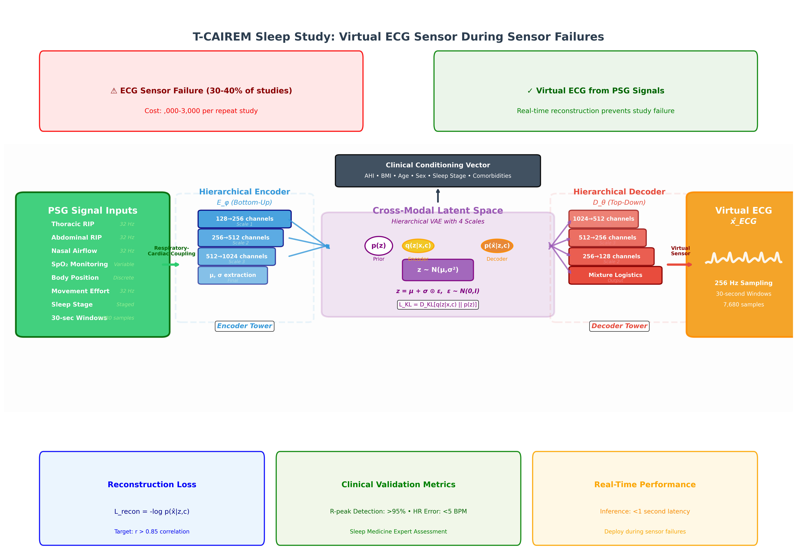

# Model Architecture

This document describes the Conditional Neural Vector Quantized Variational Autoencoder (cNVAE) architecture used for cross-modal PSG-to-ECG reconstruction.

## Overview

The cNVAE model is designed to learn cross-modal representations between polysomnography (PSG) signals and electrocardiography (ECG) signals during sleep. The architecture consists of three main components:

1. **Encoder**: Processes multi-channel PSG inputs
2. **Vector Quantization Layer**: Learns discrete latent representations
3. **Decoder**: Reconstructs ECG signals with conditioning information



## Architecture Components

### 1. PSG Encoder

**Purpose**: Extract meaningful features from multi-channel PSG signals

**Input Specifications**:
- **Channels**: 10 PSG channels (EEG, EOG, EMG, respiratory)
- **Sampling Rate**: 250 Hz (standardized)
- **Epoch Length**: 30 seconds (7,500 samples per channel)
- **Input Shape**: `[batch_size, 10, 7500]`

**Architecture**:
```python
class PSGEncoder(nn.Module):
    def __init__(self, input_channels=10, hidden_dims=[64, 128, 256, 512], latent_dim=256):
        super().__init__()
        
        # 1D Convolutional layers for temporal feature extraction
        self.conv_layers = nn.ModuleList([
            # Layer 1: Capture local temporal patterns
            nn.Conv1d(input_channels, hidden_dims[0], kernel_size=15, stride=2, padding=7),
            nn.BatchNorm1d(hidden_dims[0]),
            nn.ReLU(),
            nn.Dropout(0.1),
            
            # Layer 2: Intermediate temporal features
            nn.Conv1d(hidden_dims[0], hidden_dims[1], kernel_size=11, stride=2, padding=5),
            nn.BatchNorm1d(hidden_dims[1]),
            nn.ReLU(),
            nn.Dropout(0.1),
            
            # Layer 3: Higher-level features
            nn.Conv1d(hidden_dims[1], hidden_dims[2], kernel_size=7, stride=2, padding=3),
            nn.BatchNorm1d(hidden_dims[2]),
            nn.ReLU(),
            nn.Dropout(0.1),
            
            # Layer 4: Abstract representations
            nn.Conv1d(hidden_dims[2], hidden_dims[3], kernel_size=5, stride=2, padding=2),
            nn.BatchNorm1d(hidden_dims[3]),
            nn.ReLU(),
            nn.Dropout(0.1),
        ])
        
        # Global average pooling + projection to latent space
        self.projection = nn.Linear(hidden_dims[3], latent_dim)
```

**Key Features**:
- **Multi-scale convolutions**: Capture patterns at different temporal resolutions
- **Batch normalization**: Stabilize training and reduce internal covariate shift
- **Dropout regularization**: Prevent overfitting to specific patients/patterns
- **Residual connections**: Facilitate gradient flow (optional enhancement)

### 2. Vector Quantization Layer

**Purpose**: Learn discrete, interpretable latent representations

**Configuration**:
- **Codebook size**: 512 embeddings
- **Embedding dimension**: 256
- **Commitment cost**: 0.25
- **Exponential moving average decay**: 0.99

**Implementation**:
```python
class VectorQuantizer(nn.Module):
    def __init__(self, num_embeddings=512, embedding_dim=256, commitment_cost=0.25):
        super().__init__()
        self.embedding_dim = embedding_dim
        self.num_embeddings = num_embeddings
        self.commitment_cost = commitment_cost
        
        # Learnable codebook
        self.embedding = nn.Embedding(num_embeddings, embedding_dim)
        self.embedding.weight.data.uniform_(-1/num_embeddings, 1/num_embeddings)
        
    def forward(self, inputs):
        # Quantization process
        flat_input = inputs.view(-1, self.embedding_dim)
        
        # Calculate distances to codebook vectors
        distances = (torch.sum(flat_input**2, dim=1, keepdim=True) 
                    + torch.sum(self.embedding.weight**2, dim=1)
                    - 2 * torch.matmul(flat_input, self.embedding.weight.t()))
        
        # Find closest codebook entries
        encoding_indices = torch.argmin(distances, dim=1).unsqueeze(1)
        quantized = self.embedding(encoding_indices.squeeze())
        
        # Calculate losses
        vq_loss = F.mse_loss(quantized.detach(), inputs)
        commitment_loss = self.commitment_cost * F.mse_loss(quantized, inputs.detach())
        
        # Straight-through estimator
        quantized = inputs + (quantized - inputs).detach()
        
        return quantized, vq_loss, commitment_loss
```

**Benefits**:
- **Discrete representations**: Enables interpretable latent codes
- **Reduced posterior collapse**: Prevents degenerate solutions
- **Improved generalization**: Forces model to use diverse representations

### 3. Conditioning Module

**Purpose**: Integrate clinical and sleep stage information

**Conditioning Inputs**:
- **Sleep stage**: One-hot encoded (Wake, N1, N2, N3, REM)
- **Demographics**: Age, sex, BMI (normalized)
- **Clinical variables**: AHI, sleep efficiency, arousal index
- **Questionnaire scores**: Epworth, PSQI, etc.

**Architecture**:
```python
class ConditioningModule(nn.Module):
    def __init__(self, conditioning_dim=64):
        super().__init__()
        
        # Sleep stage embedding
        self.stage_embedding = nn.Embedding(5, 16)  # 5 sleep stages
        
        # Clinical variable processing
        self.clinical_net = nn.Sequential(
            nn.Linear(10, 32),  # 10 clinical variables
            nn.ReLU(),
            nn.Linear(32, 32)
        )
        
        # Combine all conditioning information
        self.conditioning_projection = nn.Sequential(
            nn.Linear(16 + 32, conditioning_dim),
            nn.ReLU(),
            nn.Linear(conditioning_dim, conditioning_dim)
        )
    
    def forward(self, sleep_stage, clinical_vars):
        stage_emb = self.stage_embedding(sleep_stage)
        clinical_emb = self.clinical_net(clinical_vars)
        
        combined = torch.cat([stage_emb, clinical_emb], dim=1)
        conditioning = self.conditioning_projection(combined)
        
        return conditioning
```

### 4. ECG Decoder

**Purpose**: Reconstruct 2-lead ECG signals from quantized representations

**Output Specifications**:
- **Channels**: 2 ECG leads (ECG1, ECG2)
- **Sampling Rate**: 250 Hz
- **Epoch Length**: 30 seconds (7,500 samples per channel)
- **Output Shape**: `[batch_size, 2, 7500]`

**Architecture**:
```python
class ECGDecoder(nn.Module):
    def __init__(self, latent_dim=256, conditioning_dim=64, hidden_dims=[512, 256, 128, 64]):
        super().__init__()
        
        # Combine quantized features with conditioning
        self.input_projection = nn.Linear(latent_dim + conditioning_dim, hidden_dims[0])
        
        # Transposed convolutions for signal reconstruction
        self.deconv_layers = nn.ModuleList([
            # Layer 1: Initial upsampling
            nn.ConvTranspose1d(hidden_dims[0], hidden_dims[1], kernel_size=5, stride=2, padding=2),
            nn.BatchNorm1d(hidden_dims[1]),
            nn.ReLU(),
            
            # Layer 2: Intermediate resolution
            nn.ConvTranspose1d(hidden_dims[1], hidden_dims[2], kernel_size=7, stride=2, padding=3),
            nn.BatchNorm1d(hidden_dims[2]),
            nn.ReLU(),
            
            # Layer 3: Higher resolution
            nn.ConvTranspose1d(hidden_dims[2], hidden_dims[3], kernel_size=11, stride=2, padding=5),
            nn.BatchNorm1d(hidden_dims[3]),
            nn.ReLU(),
            
            # Layer 4: Final ECG reconstruction
            nn.ConvTranspose1d(hidden_dims[3], 2, kernel_size=15, stride=2, padding=7),
            nn.Tanh()  # Constrain output range
        ])
```

## Loss Function

The total loss combines multiple objectives:

```python
def compute_loss(self, psg_input, ecg_target, sleep_stage, clinical_vars):
    # Forward pass
    encoded = self.encoder(psg_input)
    conditioning = self.conditioning_module(sleep_stage, clinical_vars)
    quantized, vq_loss, commitment_loss = self.vector_quantizer(encoded)
    reconstructed_ecg = self.decoder(quantized, conditioning)
    
    # Reconstruction loss
    recon_loss = F.mse_loss(reconstructed_ecg, ecg_target)
    
    # Perceptual loss (optional)
    perceptual_loss = self.compute_spectral_loss(reconstructed_ecg, ecg_target)
    
    # Total loss
    total_loss = (self.recon_weight * recon_loss + 
                  self.vq_weight * vq_loss + 
                  self.commitment_weight * commitment_loss +
                  self.perceptual_weight * perceptual_loss)
    
    return total_loss, {
        'reconstruction': recon_loss,
        'vq': vq_loss,
        'commitment': commitment_loss,
        'perceptual': perceptual_loss
    }
```

## Training Strategy

### Optimization
- **Optimizer**: AdamW with weight decay
- **Learning rate**: 1e-3 with ReduceLROnPlateau scheduling
- **Batch size**: 32 (adjustable based on GPU memory)
- **Gradient clipping**: 1.0 to prevent exploding gradients

### Data Augmentation
- **Temporal jittering**: ±0.1s time shifts
- **Amplitude scaling**: 0.9-1.1x amplitude variation
- **Additive noise**: Gaussian noise (σ=0.01)
- **Channel dropout**: Randomly mask 1-2 PSG channels

### Regularization
- **Dropout**: 0.1 in encoder/decoder layers
- **Weight decay**: 1e-4 for all parameters
- **Early stopping**: Patience of 10 epochs on validation loss

## Model Variations

### Enhanced Architectures (Future Work)

**1. Attention Mechanisms**:
```python
class AttentionEncoder(nn.Module):
    def __init__(self):
        self.self_attention = nn.MultiheadAttention(embed_dim=256, num_heads=8)
        self.cross_attention = nn.MultiheadAttention(embed_dim=256, num_heads=8)
```

**2. Temporal Transformers**:
```python
class TemporalTransformer(nn.Module):
    def __init__(self):
        self.transformer = nn.TransformerEncoder(
            nn.TransformerEncoderLayer(d_model=256, nhead=8),
            num_layers=6
        )
```

**3. Multi-scale Processing**:
```python
class MultiScaleEncoder(nn.Module):
    def __init__(self):
        # Parallel branches for different time scales
        self.short_term_branch = ShortTermConvNet()
        self.long_term_branch = LongTermConvNet()
        self.fusion_module = FusionNetwork()
```

## Evaluation Metrics

### Signal Quality Metrics
- **Mean Squared Error (MSE)**: Overall reconstruction accuracy
- **Pearson Correlation**: Linear relationship preservation
- **Spectral Distance**: Frequency domain similarity
- **Morphology Similarity**: ECG waveform shape preservation

### Clinical Relevance Metrics
- **Heart Rate Variability (HRV)**: Preservation of cardiac variability
- **QRS Detection**: Ability to preserve ECG fiducial points
- **Arrhythmia Detection**: Clinical pattern recognition capability

## Implementation Notes

### Memory Optimization
- Use mixed precision training (FP16)
- Gradient checkpointing for memory-intensive layers
- Batch size scaling based on available GPU memory

### Computational Requirements
- **Minimum**: 8GB GPU memory, 16GB RAM
- **Recommended**: 16GB GPU memory, 32GB RAM
- **Training time**: ~2-4 hours per epoch (depending on dataset size)

### Hyperparameter Sensitivity
- Vector quantizer parameters are critical for training stability
- Learning rate scheduling important for convergence
- Conditioning strength affects reconstruction quality

## References

1. Van Den Oord, A., et al. "Neural discrete representation learning." NeurIPS 2017.
2. Razavi, A., et al. "Generating diverse high-fidelity images with VQ-VAE-2." NeurIPS 2019.
3. Esser, P., et al. "Taming transformers for high-resolution image synthesis." CVPR 2021.
